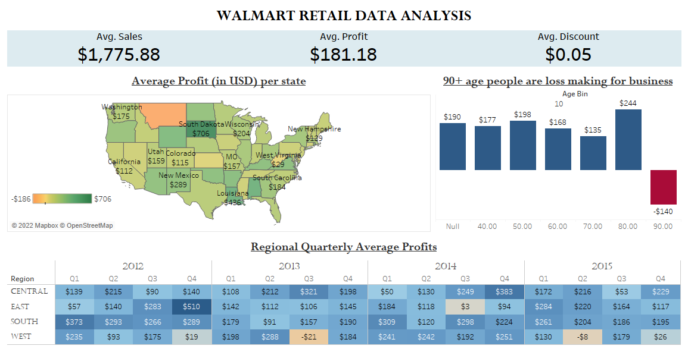

<h1 align="center">Data Visualization with Wallmart's Retail Dataset</h1>
<h4 align="center">15-10-2022</h4> 

<h3>Business Task</h3> 

The purpose of this analysis is to gain insights into:

<ol>
  <li>Wallmart's profit across all states in the United states;</li>
  <li>the relationships between customers' age and the company's profits.</li>
</ol>
<h3>Data Sources</h3> 

The Wallmart dataset is google as part of a Youtube tutorial on "how to use Tableau to analyse data". 

A summary of the dataset is as follows:

   The fields of the dataset are as follows: 
   
City, Customer Name, Customer Segment, Order Data, Order Priority, Product Category, Product Container, Product Name, Product-Sub-Category, Region, Ship Date, Ship Mode, State, Customer Age, Discount, Number of Records, Order ID, Order Quantity, Purchase Base Margin, Profit, Row ID, Sales, Shipping Cost, Unit Price, Zip Code

<h3>Data Visualization Tool</h3>

Tableau was visualization software used.
 

<h3>Data Visualization Process</h3>

The following steps were taken in Tableau:
 
<ol>
   <li>Average measures were calculated for Sales, Profit and Discount.</li>
   <li>A map is created of all states in the United State. Average profit and sales per state are used as labels.</li>
   <li>A bar chart is created in order to ascertain the relationsips between customers' ages and profits. The age measure is converted into Bins.</li>
   <li>Regional Profits were tabulated an a yearly and quaterly basis.</li>
   <li>A dashboard is created to nicely combine and present all the aforementioned chards.</li>
</ol>
<h3>Dashboard</h3>

    

<h3>Key Findings</h3> 

The following insights were discovered: 

<ol>
<li>Customers who are above are loss making for the business.</li>  
<li>Profit is beginning to take an upward direction.</li> 
</ol>
<h3>Recommendations </h3>
<ol>
<li>Customers of ages less than 90 years old should be the focus of marketing campaigns.</li>  
</ol>
 
<h4 align="center">Download the Wallmart Dataset <a href="https://github.com/shittuadams/WallmartDataAnalysis/blob/main/Walmart-Retail-Data.xlsx" target="_blank">here</a>.</h4>
